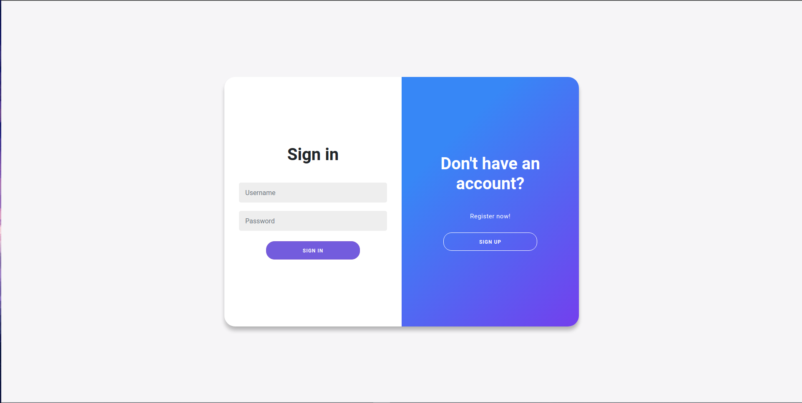

# Cloud storage implementation using Azure Services

This project demonstrates the usage of [Azure Storage SDK](https://github.com/Azure/azure-storage-blob-go) and [SQL Database on Azure](https://azure.microsoft.com/products/azure-sql/database/) along with JWT tokens for authentication and some other features.

## Features

- Username and Password based user authentication
- Authenticated API calls using JWT Tokens
- Upload files as Blobs to Azure Storage Containers
- Maintains per-user version history for each file uploaded
- List all files uploaded by a specific user after authentication
- Download / Delete files by version
- Good looking frontend (subjective)

## Implementation and screenshots




## How to build

Clone this repository along with submodules

```bash
git clone --recurse-submodules --remote-submodules
```

### Using Make

To run the app

```bash
make run
```

To simply generate a compiled binary

```bash
make build
```

### Manually

Install all dependencies for the website using [Yarn](https://yarnpkg.com/)

```bash
cd frontend
yarn install 
```

Compile and bundle the frontend

```bash
yarn build
```

Copy the generated bundle to static directory

```bash
mkdir ../static
cp dist/ ../static
```

then run

To generate a binary

```bash
go build
```

To run the app without generating a binary

```bash
go run main.go
```

